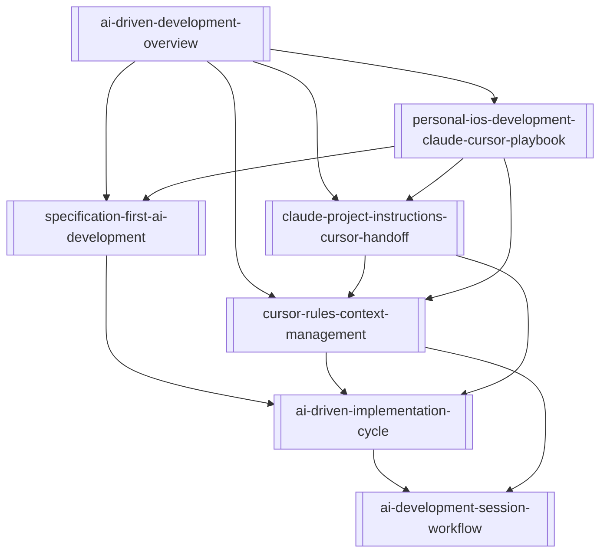

# AI-Driven Development — Map of Content

This map organizes the AI-driven development methodology in this wiki, from high-level framing to practical execution loops. Start with the overview, then move to specification-first planning, context control with Cursor rules, and finally the implementation and session workflows used in day-to-day development.

## Concepts

| Note | Summary |
|------|---------|
| [[ai-driven-development-overview]] | Defines the overall method where humans own design intent and AI accelerates implementation. |
| [[specification-first-ai-development]] | Explains how explicit requirements are designed before code generation begins. |
| [[cursor-rules-context-management]] | Describes how `.cursor/rules/` preserves project context across chat resets. |
| [[ai-driven-implementation-cycle]] | Covers the per-feature execution loop: implement, review, build, verify, and commit. |
| [[ai-development-session-workflow]] | Defines session-level operating rhythm, tool boundaries, and Git hygiene. |
| [[claude-project-instructions-cursor-handoff]] | Describes a project-level Claude brief that routes implementation to Cursor via structured handoff prompts. |

## Topics

| Note | Summary |
|------|---------|
| [[personal-ios-development-claude-cursor-playbook]] | End-to-end solo iOS practice from idea language to App Store, aligned with the core methodology. |

## Concept Map

## Open Stubs

Notes that are linked but not yet written:

None.
