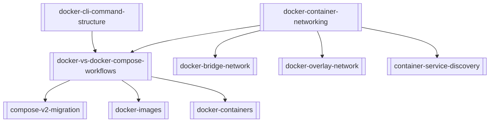

# Docker — Map of Content

This map organizes core Docker learning paths in this wiki, from command-line fundamentals to container networking and multi-service orchestration. Start with the CLI structure note, then move to networking, and finally use the workflow topic to compare manual and Compose-based development approaches.

## Concepts

| Note | Summary |
|------|---------|
| [[docker-cli-command-structure]] | Explains Docker's top-level and subcommand hierarchy and common operational workflows. |
| [[docker-container-networking]] | Covers default and user-defined networks, including bridge and overlay behavior. |
| [[compose-v2-migration]] | Describes the shift from legacy `docker-compose` to modern `docker compose` workflows. |
| [[docker-bridge-network]] | Details single-host container connectivity, isolation boundaries, and controlled port publishing. |
| [[docker-overlay-network]] | Explains multi-host virtual networking for distributed container communication. |
| [[container-service-discovery]] | Describes DNS-based name resolution between containers and services. |
| [[docker-images]] | Defines immutable, layered artifacts used to build and distribute application runtimes. |
| [[docker-containers]] | Covers isolated runtime instances, lifecycle control, and operational patterns. |

## Topics

| Note | Summary |
|------|---------|
| [[docker-vs-docker-compose-workflows]] | Compares single-container command workflows with declarative multi-container Compose workflows. |

## Concept Map

## Open Stubs

Notes that are linked but not yet written:

None.
