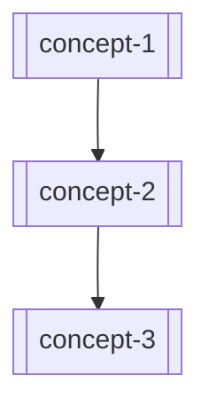

# {{Theme}} — Map of Content

{{One paragraph describing what this map covers and how to navigate it.}}

## Concepts

| Note | Summary |
|------|---------|
| [[concept-1]] | {{one-line description}} |
| [[concept-2]] | {{one-line description}} |

## Topics

| Note | Summary |
|------|---------|
| [[topic-1]] | {{one-line description}} |

## Concept Map

## Open Stubs

Notes that are linked but not yet written:

- [[stub-concept-1]]
- [[stub-concept-2]]